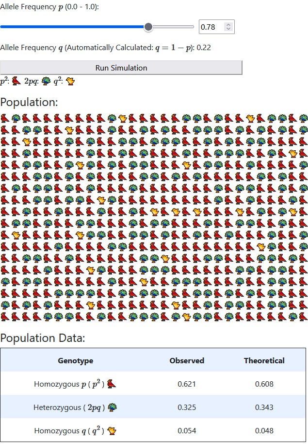
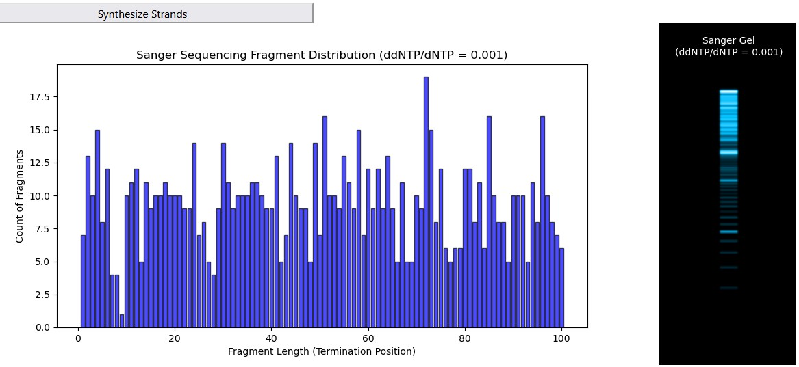
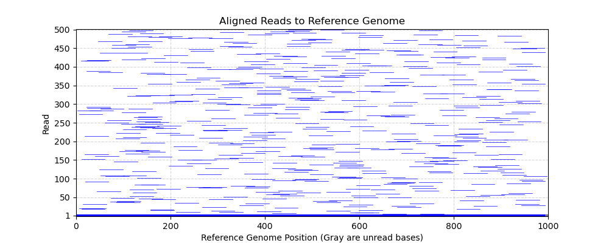
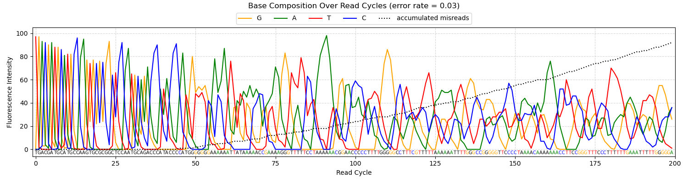
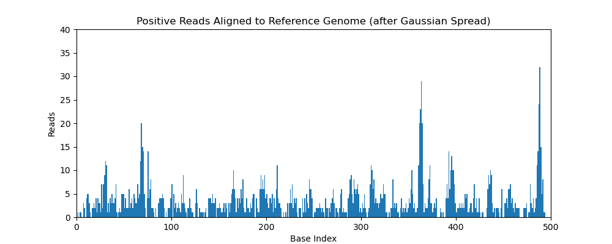

# Bioinformatics Concepts Website

## Overview

This project is a web-based tool designed to introduce and simulate fundamental bioinformatics concepts. Users can explore various biological and computational principles through interactive simulations. The site is built using **Flask**, **Bootstrap**, and **Matplotlib**, with visualizations to aid learning.

## Features

### Simulations

- **Hardy-Weinberg Equilibrium**: A simulation demonstrating allele frequency stability in a non-evolving population.



- **Sanger Sequencing**: Explore how ddNTP/dNTP ratios affect sequencing fragment distributions. Includes a histogram of fragment lengths and a simulated gel electrophoresis output.



- **Coverage Simulation**: Visualize sequencing coverage based on read length, number of reads, and genome size.



- **Phasing Problem with Illumina Sequencing**: Interactive exploration of how phasing affects the usable length of reads.



- **ChIP Sequencing**: Simulate how antibody specificity influences read distribution and peak formation in ChIP-seq data.



## Technologies Used

- **Flask**: Backend framework for handling requests and rendering pages.
- **Bootstrap**: Responsive front-end styling.
- **Jinja2**: Templating engine for dynamic content.
- **Matplotlib**: Generates plots for simulations.

## Installation

To run this project locally:

1. Clone the repository:

   ```sh
   git clone https://github.com/richgoodier/bioinformatics_concepts.git
   cd bioinformatics_concepts
   ```

2. Create a virtual environment (optional but recommended):

   ```sh
   python -m venv venv
   source venv/bin/activate  # On Windows use `venv\Scripts\activate`
   ```

3. Install dependencies:

   ```sh
   pip install -r requirements.txt
   ```

4. Run the Flask application:

   ```sh
   flask run
   ```

5. Open `http://127.0.0.1:5000/` in your browser.

## Folder Structure

```text
│── app.py
│── static/
│   ├── styles.css
│   ├── plots/
│   ├── screenshots/       # Stores README images
│       ├── hardy_weinberg.jpg
│       ├── sanger.jpg
│       ├── coverage.png
│       ├── phasing.png
│       ├── chipseq.png
│── templates/
│   ├── layout.html
│   ├── index.html
│   ├── hardy_weinberg.html
│   ├── sanger.html
│   ├── coverage.html
│   ├── phasing.html
│   ├── chip-seq.html
│── hardy_weinberg.py
│── sanger.py
│── coverage.py
│── phasing.py
│── ChIP_seq.py
│── visualizations.py
│── initialization.py
```

## Contact

For requests or suggestions, email [goodier.r@northeastern.edu](mailto:goodier.r@northeastern.edu).
